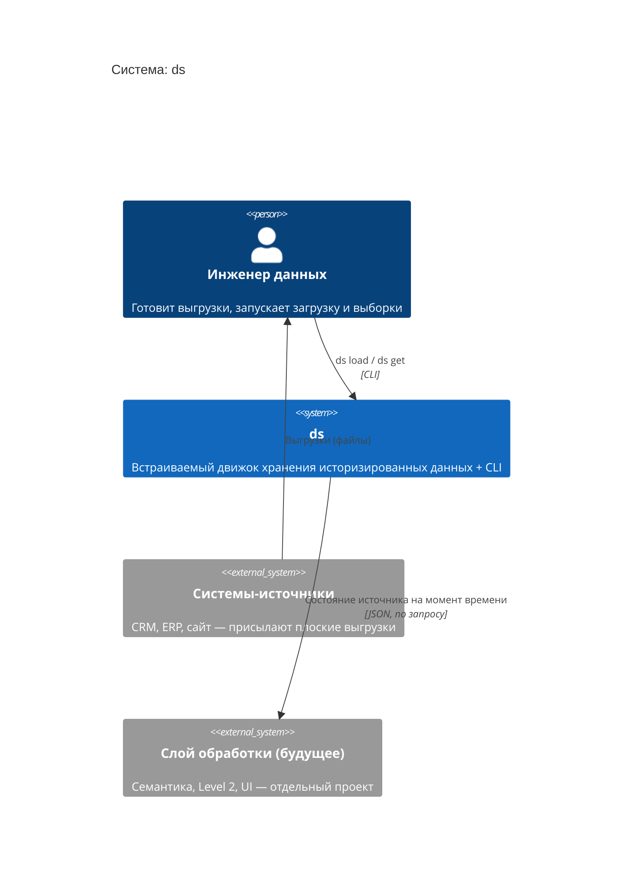
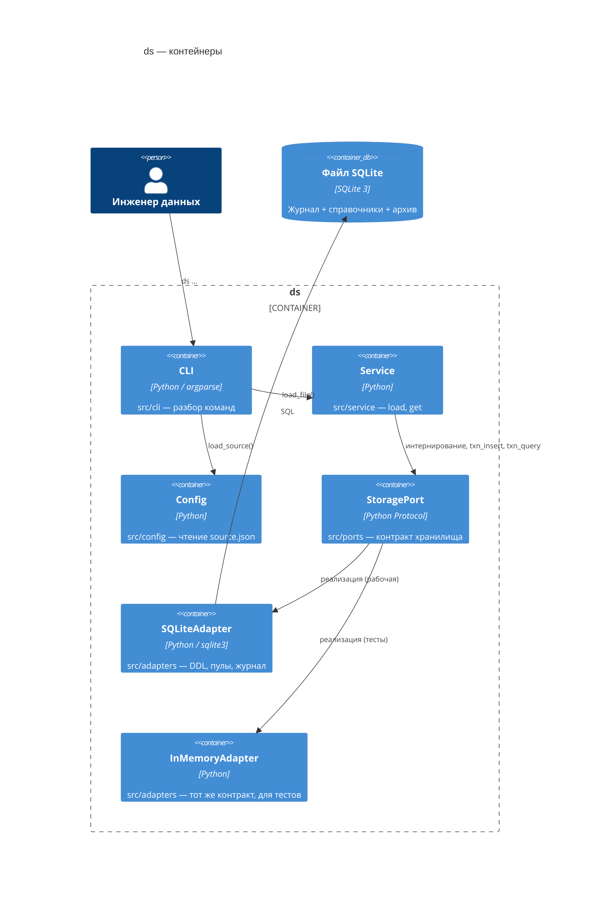
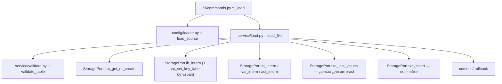

# Архитектура (как в коде)

Соответствует коду на 0.5.0a1 (+ `ds get`). Полный обзор замысла верхнего уровня — в
[`../explanation/overview.md`](../explanation/overview.md); аспирационная версия из 11
компонентов — в [`../attic/components-architecture-2025-11.md`](../attic/components-architecture-2025-11.md)
(по ней **не** строим).

## Реальная раскладка `src/`

```
src/
├── domain/            чистые типы, без ввода-вывода
│   ├── entities.py    SrcId/LbId/IdId/ValId/ActId/CntId (NewType), Src, Lb,
│   │                  TransactionInput, Transaction
│   ├── enums.py       Act (POST/GET/PATCH/DELETE)
│   ├── errors.py      NotFound, AlreadyExists, ValidationError, StorageError, IntegrityError
│   └── result.py      Ok[T] / Err[E] с .and_then / .map
│
├── ports/             интерфейсы (typing.Protocol)
│   ├── storage_port.py  StoragePort — весь контракт хранилища
│   └── clock_port.py    ClockPort — источник времени (now() -> float)
│
├── adapters/          реализации портов
│   ├── sqlite_adapter.py    SQLiteAdapter — рабочее хранилище, DDL, кеши пулов
│   ├── inmemory_adapter.py  InMemoryAdapter — для тестов, тот же контракт
│   └── system_ports.py      SystemClock (time.time)
│
├── persistence/      отображение «строка БД ↔ доменный объект»
│   ├── records/       *Record — плоские DTO под строки таблиц (src, lb, transaction)
│   └── mappers/       record_to_domain / domain_to_record / input_to_row
│
├── config/           работа с source.json
│   ├── models.py      SourceConfig, LabelConfig
│   ├── loader.py      load_source(dir) -> Ok[SourceConfig]
│   └── validator.py   validate_source / validate_label (диапазон p, key_label ∈ labels)
│
├── service/          прикладные операции (внутренний фасад)
│   ├── load.py        load() / load_file() — загрузка колоночного JSON, авто-act
│   ├── get.py         fold_source / build_source / run_get — свёртка Level 1, выгрузка JSON; load_preset
│   └── validate.py    validate_table() — форма входной таблицы
│
└── cli/
    └── commands.py   argparse; команды: load, get
```

Пакетов `storage/`, `pools/`, `core/`, `entities/`, `processing/`, `snapshots/`, `archive/`,
`utils/` из старого `PROJECT_STRUCTURE.md` **нет**. String pools — не отдельный компонент, а
таблицы + кеши внутри `SQLiteAdapter` (см. [`../explanation/dictionary-encoding.md`](../explanation/dictionary-encoding.md)).

## C4 — Level 1: контекст



## C4 — Level 2: контейнеры



## C4 — Level 3: компоненты `service` (путь загрузки)



## Поток данных при `ds load`

Пошагово (с номерами строк) — в [`../guides/loading-data.md`](../guides/loading-data.md), раздел 2.

1. `validate_table` — форма таблицы (колонки-списки одной длины, `key_label` без `null` и без дублей).
2. `storage.begin()` — весь батч атомарно.
3. `src_get_or_create(name)` — источник (создаётся с `key_label = NULL`).
4. `lb_intern(key_label, src_id)` → при первом разе `src_set_key_label`.
5. `lb_intern` для остальных колонок; `id_intern` для значений ключа.
6. `txn_last_values` — одним запросом последнее значение по всем `(lb, id)` батча (для авто-`act`).
7. По ячейкам: `null` → `DELETE`; нет прежнего значения → `PATCH`; есть → `POST`. `val_intern`, `txn_insert`.
8. `commit()` (или `rollback()` на любой ошибке).

## Поток данных при `ds get`

Read-only, без управления транзакцией. `cli/commands.py :: _get` → (опц.)
`service/get.py :: load_preset` → `merge_overrides` (флаги перекрывают пресет) →
`run_get` → для каждого источника `build_source`: `lb_list` (резолв показателей) →
`txn_query(src_id, until_dt, include_archive)` → `fold_source` (победитель по `(dt, cnt)`) →
`id_get` / `val_get` (резолв в строки) → широкая таблица `{meta, data}`.
Формат — [`get-output-format.md`](get-output-format.md).
